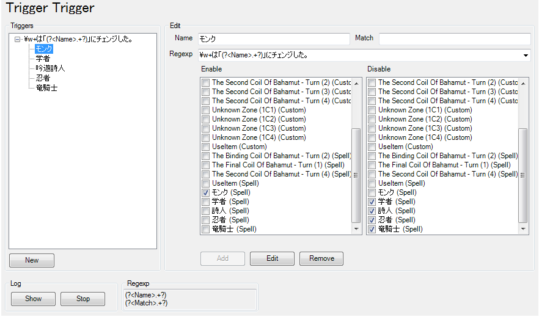

# act Trigger Trigger Plugin

Advanced Combat Trackerのカスタムトリガーとスペルタイマーのon/offを、正規表現で管理します。

## Screenshot

Regexpに入力した正規表現にマッチした場合、Enable側でチェックされたトリガーを有効化します。  
同時に無効化したい物はDisable側へチェックをいれてください。  
もしRegexp内で`(?<Name>.+?)`や`(?<Match>.+?)`など名前付きのグループ化を使用した場合、NameやMatchに入力している内容と一致した場合のみ作動します。  

#### FFXIV_ACT_Pluginと併用する場合
Triggerプラグインが先にロードされるように調整することで、FFXIV_ACT_Pluginのログファイルと同じテキストを得られます。Showボタンで確認できます。